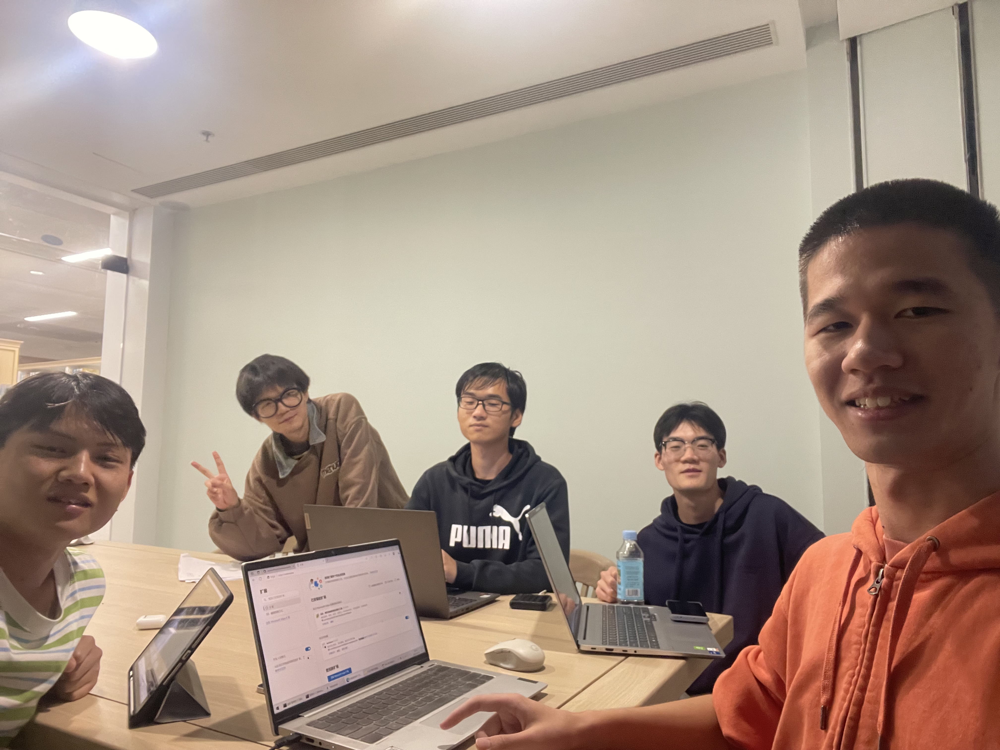
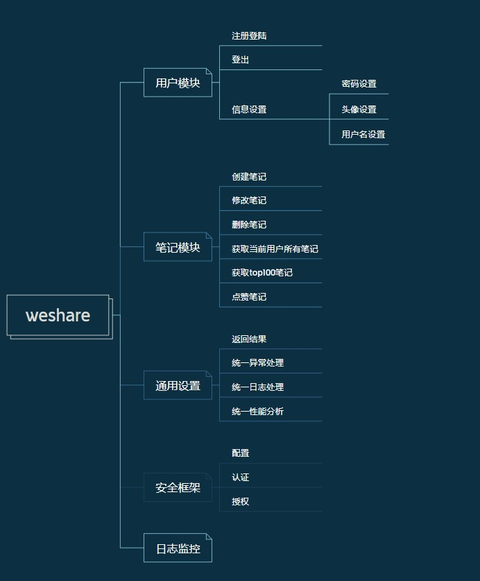

# 第七周会议记录

### 1.会议照片

### 2.任务与规划

#### 后端设计

#### 前端设计--插件

### 3.任务及完成情况

#### 后端任务

- [x] 认证登录功能
- [x] 异常处理功能
- [x] 统一日志功能

#### 前端任务--官网

- [x] 登录注册页面

#### 前端任务--插件

- [x] 将数据存储转移至background
- [x] 增加设置页面
- [x] 增加基础设置功能(字体大小，颜色等)
- [x] 增加笔记收拢/展开功能
- [x] *增加回收站功能

#### 个人任务及其完成情况

| 姓名             | 完成任务                                                     | 下一步计划                             |
| ---------------- | ------------------------------------------------------------ | -------------------------------------- |
| 洪曹奕           | 详见上文“前端任务--插件”部分                                 | 尝试完善高亮功能。尝试与后台连接交互。 |
| 刘家诚           | 学习相关知识，完善登录注册界面，增加交互功能                 | 进一步完善官网界面                     |
| 余会涛           | 学习相关知识，完成界面元素统一与部分前端逻辑                 | 完善前端事件处理以及优化性能           |
| 李俊义           | 后台系统认证与授权功能实现，统一异常处理功能实现，统一日志记录功能实现。 | 进一步完善后台                         |
| 刘思凯           | 改善了上周的代码，并进行了spring security的学习              | 进一步完善后端逻辑                     |
| 陈岳阳(参与ICPC) | 参与细节商定                                                 | 待定                                   |

### 前端效果图

设置界面

展开/合拢演示

回收站演示

